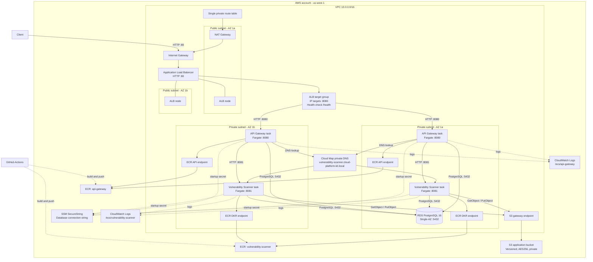

# Architecture

## Overview

Cloud Platform Kit is a two-service application deployed to AWS ECS on Fargate.
An internet-facing Application Load Balancer exposes the API Gateway, while the
Vulnerability Scanner remains private and is discoverable only inside the VPC.
Postgres stores structured scan findings, and S3 stores full scan reports.

The infrastructure is provisioned by Terraform in `us-west-1`. It deliberately
uses a cost-conscious development topology: one NAT Gateway and a Single-AZ RDS
instance, while the ALB and ECS services span two Availability Zones.

Stage 1 creates the AWS infrastructure skeleton. The ECS task definitions initially
run pinned BusyBox placeholder HTTP servers. Later stages build the Go services,
push their images to ECR, and replace the placeholder task definition images.

## Architecture Diagram



The diagram shows possible task placement in both private subnets. Each service
currently has a desired count of one, so ECS runs one API Gateway task and one
Vulnerability Scanner task at a time and may place either task in either subnet.
RDS is explicitly placed in Availability Zone 1a.

## Network Layout

### VPC and subnets

The application runs inside one VPC with CIDR `10.0.0.0/16`. DNS support and DNS
hostnames are enabled so AWS private DNS, VPC endpoints, and Cloud Map work inside
the network.

The VPC contains four subnets across two Availability Zones:

| Subnet | Exposure | Purpose |
|---|---|---|
| `public-1a` | Public route table | ALB node and the single NAT Gateway |
| `public-1b` | Public route table | Second ALB node for multi-AZ ingress |
| `private-1a` | Private route table | ECS tasks, VPC endpoints, and Single-AZ RDS |
| `private-1b` | Private route table | ECS tasks and VPC endpoints; also required by the RDS subnet group |

The two public subnets use a default route through the Internet Gateway. Both
private subnets share one private route table whose default route uses the NAT
Gateway in `public-1a`. ECS tasks have no public IP addresses.

### VPC endpoints

Three VPC endpoints reduce NAT Gateway traffic:

- The S3 gateway endpoint is associated with the single private route table.
- The ECR API interface endpoint exists in both private subnets with private DNS.
- The ECR DKR interface endpoint exists in both private subnets with private DNS.

The ECR endpoint security group accepts TCP `443` only from the VPC CIDR. Other
outbound HTTPS traffic can use the NAT Gateway.

## Request Flow

1. A client resolves the ALB DNS name exported by Terraform.
2. The client sends an HTTP request to the internet-facing ALB on port `80`.
3. The ALB listener forwards the request to the API Gateway target group.
4. The target group routes traffic to the API Gateway task on port `8080` using
   the task's private IP address. Fargate requires the target type to be `ip`.
5. The ALB checks `/health`; only healthy API tasks receive requests.
6. When the API Gateway needs a scan, it resolves
   `vulnerability-scanner.cloud-platform-kit.local` through the private Cloud Map
   namespace and calls the scanner on port `8081`.
7. The scanner processes the request, stores structured findings in Postgres, and
   writes the complete report to the private S3 application bucket.
8. The response returns from the scanner through the API Gateway and ALB to the
   client.

The scanner has no load balancer and cannot be reached directly from the internet.

## Compute Layer

The `cloud-platform-kit` ECS cluster contains two Fargate services:

| Service | Port | Desired count | Exposure | Discovery |
|---|---:|---:|---|---|
| `api-gateway` | `8080` | 1 | ALB target group | ALB DNS output |
| `vulnerability-scanner` | `8081` | 1 | VPC only | Cloud Map private DNS |

Both task definitions use:

- Fargate compatibility and `awsvpc` networking.
- `256` CPU units and `512` MiB memory.
- Private subnets in both Availability Zones.
- The shared ECS security group.
- A dedicated application task role.
- The shared ECS task execution role.
- The `awslogs` log driver.

During Stage 1, each task runs `public.ecr.aws/docker/library/busybox:1.38.0` as a
small placeholder web server. The API placeholder listens on `8080`, the scanner
placeholder listens on `8081`, and both expose a `/health` file. These images prove
that the network and ECS resources are wired correctly; they are not the final
application containers.

## Service Discovery

AWS Cloud Map provides the private namespace `cloud-platform-kit.local`. The
Vulnerability Scanner ECS service registers its task IP in an A record named
`vulnerability-scanner` with a TTL of 10 seconds and multivalue routing.

The API Gateway receives this internal endpoint as:

```text
SCANNER_URL=http://vulnerability-scanner.cloud-platform-kit.local:8081
```

This avoids hard-coded task IP addresses. When ECS replaces a scanner task, its
Cloud Map registration is updated and the API continues using the stable DNS name.

## Data Layer

### RDS PostgreSQL

RDS runs PostgreSQL 16 on a `db.t3.micro` instance with 20 GiB of allocated
storage. It is Single-AZ in Availability Zone 1a and is not publicly accessible.
The DB subnet group contains both private subnets because RDS requires subnet
coverage across at least two Availability Zones even when the instance itself is
Single-AZ.

The database holds persistent, structured application data such as scan metadata,
status, image references, timestamps, and summarized vulnerability findings.

Deletion protection is disabled and final snapshots are skipped so the development
stack can be destroyed cleanly. This is a cost-saving development decision and is
not suitable for a production database without backup and recovery changes.

### S3 application bucket

The application bucket is separate from the Terraform state bucket. Its name uses
the pattern `cloud-platform-kit-app-<account-id>` and it stores full vulnerability
scan reports and application artifacts.

The bucket has:

- S3 versioning enabled.
- AES256 server-side encryption enabled.
- All four public-access-block settings enabled.
- A lifecycle rule that expires current and noncurrent object versions after 90
  days.

Only the Vulnerability Scanner task role can read and write bucket objects.

## Secrets and Configuration

Terraform constructs the Postgres connection string and stores it as the SSM
SecureString parameter:

```text
/cloud-platform-kit/db/connection-string
```

Both task definitions refer to the parameter ARN through the ECS `secrets`
configuration. At task startup, ECS uses the task execution role to call
`ssm:GetParameters` and injects the decrypted value as `DATABASE_URL`. The value is
not declared as a plain-text environment entry in the task definition.

The database password is supplied through the sensitive Terraform variable
`rds_database_password`. Its real value belongs only in the gitignored
`terraform.tfvars` file. Because Terraform uses the password to create RDS and the
SSM parameter, the value is still present in Terraform state; access to the state
bucket must therefore remain tightly controlled.

Non-secret runtime configuration is passed normally:

- API Gateway receives `SCANNER_URL`.
- Vulnerability Scanner receives `S3_BUCKET`.

## IAM Model

The design separates infrastructure startup permissions from application runtime
permissions.

### ECS task execution role

ECS assumes `ecs-task-execution` before starting containers. It has:

- The AWS-managed `AmazonECSTaskExecutionRolePolicy` for ECR image pulls and
  CloudWatch log delivery.
- `ssm:GetParameters` on the exact database connection parameter ARN.

### API Gateway task role

The API Gateway container assumes `api-gateway-task`. It currently has no AWS API
permissions because ECS injects its database secret using the execution role and
the API does not access S3 directly.

### Vulnerability Scanner task role

The scanner container assumes `vulnerability-scanner-task`. It can call only:

- `s3:GetObject` on objects in the application bucket.
- `s3:PutObject` on objects in the application bucket.

The permissions use the bucket object ARN rather than a wildcard resource across
all S3 buckets.

## Security Groups

Security groups enforce the intended communication paths:

| Security group | Inbound | Purpose |
|---|---|---|
| ALB | TCP `80` from `0.0.0.0/0` | Public HTTP entry point |
| ECS | TCP `8080` from the ALB security group | ALB to API Gateway |
| ECS | TCP `8081` from itself | API Gateway to Vulnerability Scanner |
| RDS | TCP `5432` from the ECS security group | ECS tasks to Postgres |
| ECR endpoints | TCP `443` from `10.0.0.0/16` | Private ECR API and image access |

ECS egress permits PostgreSQL traffic to the RDS security group and HTTPS traffic
on port `443`. The ALB permits outbound traffic so it can reach registered API
targets.

The current project intentionally uses HTTP rather than HTTPS and does not create
an ACM certificate. A production deployment should terminate TLS at the ALB and
redirect HTTP to HTTPS.

## Container Image Flow

Two private ECR repositories exist, one for each service:

- `api-gateway`
- `vulnerability-scanner`

Both repositories use immutable tags and scan images on push. Lifecycle policies
expire untagged images after one day and retain only the latest ten images.

In later stages, GitHub Actions builds and pushes each service image. ECS pulls
private images using the task execution role. The ECR API and DKR interface
endpoints keep most ECR traffic private, while the S3 gateway endpoint supports the
S3 layer used during ECR image pulls.

## Logging and Observability Foundation

Container stdout and stderr are sent to dedicated CloudWatch log groups:

- `/ecs/api-gateway`
- `/ecs/vulnerability-scanner`

Both log groups retain events for seven days. Later observability work can add
OpenTelemetry traces and metrics without changing the base network topology.

## Terraform State and Outputs

The main Terraform state is stored remotely in the separate private state bucket
under `main/terraform.tfstate`. The backend uses AES256 encryption and native S3
lock files. The state bucket is bootstrapped separately and is not part of the
normal application stack destroy operation.

Terraform exports:

- The ALB DNS name.
- Both ECR repository URLs.
- The S3 application bucket name and ARN.
- The three ECS IAM role ARNs.

## Availability and Cost Trade-offs

This is a development and portfolio architecture rather than a production high-
availability design.

- The ALB spans two Availability Zones.
- ECS can place tasks in either private subnet, but each service has only one task.
- RDS is Single-AZ and has no standby instance.
- One NAT Gateway serves both private subnets and is a single point of failure.
- VPC endpoints reduce NAT data-processing costs for ECR and S3 traffic.
- Seven-day log retention and 90-day report retention limit storage costs.
- `skip_final_snapshot = true` supports frequent stack destruction but sacrifices
  database recovery during destroy.

For production, use at least two tasks per service, Multi-AZ RDS, NAT Gateways per
Availability Zone, HTTPS with ACM, database backups, deletion protection, alarms,
and stricter egress controls.

## Stage 1 Completion Checklist

Stage 1 is complete only after `terraform apply` succeeds and the deployed
resources are verified:

- The ALB is active in both public subnets and its listener forwards port `80` to
  the API target group on port `8080`.
- The ECS cluster contains both services with desired count one.
- Both task definitions are registered and tasks can start.
- The scanner registers in Cloud Map and resolves from the API task.
- RDS is available, private, and located in Availability Zone 1a.
- The SSM SecureString parameter exists.
- The application S3 bucket is private, encrypted, versioned, and lifecycle-managed.
- Both ECR repositories and all three VPC endpoints are available.
- Both CloudWatch log groups exist with seven-day retention.
- `terraform output alb_dns_name` returns the public application endpoint.

After those checks pass, the foundational infrastructure stage is finished. The
next stages replace the placeholder containers with the real Go services and add
build, deployment, observability, and security automation.
